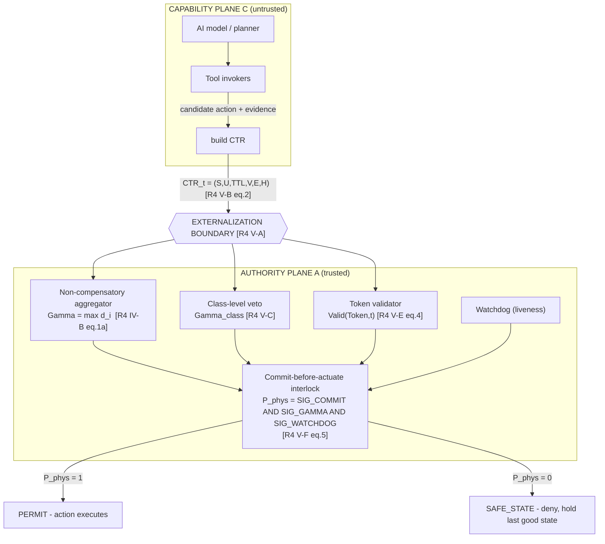
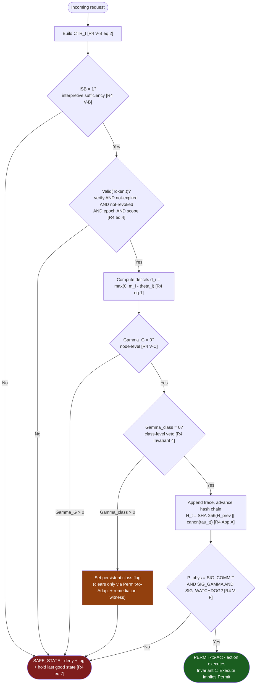

# 🛡️ LAB v1.0 – Runtime AI Safety Verification Framework

> **A runtime verification system that checks every AI decision before it is allowed to execute.**

This project demonstrates how an AI system can be continuously monitored at runtime to prevent unsafe, malicious, or unauthorized actions.

Instead of trusting an AI model blindly, this framework places a **verification layer** between the AI and the final action.

If the request is considered safe, it is **approved**.

If any security rule is violated, the system immediately blocks the request and moves into a **SAFE_STATE**.

---

# 🎯 Why was this project built?

Modern AI systems can make mistakes or even be manipulated through attacks such as:

- Prompt Injection
- Fake Authorization
- Expired Access Tokens
- Context Manipulation
- Replay Attacks
- Privilege Escalation

This project demonstrates how those attacks can be detected **before** the AI performs a sensitive action.

Think of it as:

> **An airport security checkpoint for AI systems.**

Every request is inspected before being allowed to continue.

---

# 📚 Based on Published Research

This framework is a **reference implementation** of the *externalization monitor* defined in two companion IEEE Access papers. The papers are the specification; this code implements the decision logic and benchmark protocol.

| Tag | Paper | Used in this project for |
|-----|-------|--------------------------|
| **[R4]** | *Deterministic Runtime Enforcement: The Execution Authority for Autonomous AI Agents* (L-DREA), IEEE Access (submitted, May 2026) | Threat model, structural properties, 6 invariants, LAB v1.0 benchmark spec, formulas, ablation & latency reference numbers, TLA⁺ Invariant 1 |
| **[A9]** | *A Substrate-Neutral Reference Monitor for the Execution Boundary*, IEEE Access Manuscript Access-2026-24317 | Same architecture (condensed), patent disclosure, latency anchor |

Throughout this README, tags like **[R4 §IV-B]** point to the exact section/equation each rule, formula, or dataset comes from.


# 🚀 Project Workflow

```text
Incoming Request
        │
        ▼
 Runtime Verification Engine
        │
        ├──────────────┐
        │              │
     SAFE             UNSAFE
        │              │
        ▼              ▼
 PERMIT ACTION     SAFE_STATE
```

---

# 📂 Project Structure

```text
.
├── maincode.py                ← Main program (Run this file)
├── maincodedashboard.html     ← Interactive dashboard generated after execution
├── testdata.csv               ← Sample dataset used for testing
├── lab_benchmark.py           ← Benchmark engine
├── dashboard.html             ← Benchmark dashboard
├── ertuple_audit_manifest.json
├── test_baseline_metrics.py
├── test_corpus_enforcement.py
└── README.md
```

---

# 📌 Main Files

## ✅ maincode.py

This is the **main entry point** of the project.

Running this file performs the complete verification process.

It:

- Loads the test dataset
- Runs Runtime Enforcement
- Executes attack simulations
- Calculates security metrics
- Generates reports
- Creates the HTML dashboard

> **If you only want to run the project, this is the only file you need to execute.**

---

## 📊 maincodedashboard.html

This dashboard is automatically generated after running `maincode.py`.

It provides a visual representation of:

- Runtime verification results
- Security metrics
- Attack simulations
- Interactive graphs
- Performance analysis

Instead of reading logs in the terminal, simply open this HTML file in any web browser.

---

## 📁 testdata.csv

This is the sample dataset used to test the framework.

It contains example requests representing both:

- Legitimate actions
- Malicious or unsafe actions

The verification engine processes every row and decides whether it should be:

- **PERMIT**
- **SAFE_STATE**

You can replace this dataset with your own CSV to evaluate different scenarios.

---

# ⚙️ How the System Works

For every incoming request, the system verifies:

- ✅ Authorization
- ✅ Token Validity
- ✅ Security Rules
- ✅ Runtime Conditions
- ✅ Risk Thresholds

If every rule passes:

```text
PERMIT
```

Otherwise:

```text
SAFE_STATE
```

---

# 🧭 Architecture (Two-Plane Runtime)

The system is a **two-plane runtime** *[R4 §V-A, A9 §V-A]*. The **capability plane** (untrusted) proposes actions; the **authority plane** (trusted) decides whether they may cross the externalization boundary. Nothing executes without a valid Permit-to-Act.



---

# 🔄 Per-Request Verification Flow

The exact order in which every request is evaluated. Each gate maps to a formula and an invariant in the papers.



**Key property this order encodes** *[R4 Invariant 3 / Corollary 1]*: the moment **any** `d_i > 0`, the aggregate `Gamma > 0`, so the permit indicator is 0 and the request short-circuits to SAFE_STATE — no matter how clean every other dimension is. There is no path where a weighted average rescues a failing safety check.

---

# 🧮 The Decision Rule — Where Every Formula Comes From

Every formula this code evaluates, mapped to the exact equation in the papers, with *what* it does and *why*.

### Per-metric deficit `[R4 §IV-B eq.1]`
```
d_i = max(0, m_i − θ_i)
```
**What:** for each check `m_i` with threshold `θ_i`, how far it is over the line (`0` = within threshold).
**Why:** turns heterogeneous checks (sanctions freshness, allergy contraindication, telemetry age) into a uniform non-negative deficit so they can be aggregated.

### Law of Concurrence — the aggregate `[R4 §IV-B eq.1a/1b, A9 §IV-B]`
```
Γ = max_i d_i          (aggregate deficit)
Π = 1[Γ = 0]           (permit only if every deficit is zero)
```
**What:** the permit is granted **only if every dimension is clean**. The max-aggregator means no surplus offsets a deficit.
**Why this rule and not a weighted/disjunctive sum `[R4 Corollary 2]`:** a weighted sum `Σ w_i d_i` or disjunctive `min_i d_i` lets a surplus on one dimension hide a deficit on a safety-critical one — defeating fail-closed semantics. Your **negative-control baseline** (Γ replaced by weighted sum) exists to prove this: it leaks (**FPR 6.4%** in the paper) where the max-aggregator does not.
**Equivalence the code uses `[R4 Proposition 1]`:** `Γ = 0 ⇔ ∀i, d_i = 0` — this is what lets `SIG_GAMMA` be a single boolean.

### Class-level veto `[R4 §V-C, Invariant 4]`
```
Γ_G     = max_j Γ^(j)
Γ_class = max_{i∈I_class} d_i^class
authority granted iff max(Γ_G, Γ_class) = 0
```
**What:** a separate veto over behavioral metrics (drift, reward-hacking proxies, autonomy band). Once a class deficit is recorded, that class is denied **until explicit remediation**.
**Why:** stops Goodhart-style gaming — passing every node check while degrading class behavior. Persistence is the point: only a `Permit-to-Adapt` with a remediation witness clears the flag.

### Permit-token validity `[R4 §V-E eq.4, A9 §V-E]`
```
Valid(Token, t) = Verify(σ) ∧ (t ≤ expires_at) ∧ ¬Revoked(Token)
                  ∧ (K_t = K_current) ∧ ScopeOK(op, scope)
```
Lifecycle: `ISSUED → ACTIVE → {CONSUMED, EXPIRED, REVOKED}`; consumption is **atomic & single-use**.
**What/why:** binds each action to an epoch-keyed, scope-checked, single-use token so a permit cannot be forged, replayed, scope-escalated, or used past expiry.
> ℹ️ **Note:** the papers specify `σ` as an epoch-keyed **signature** (Assumption A1). This project's **HMAC Token Validation** is a software-realizable equivalent for demonstration purposes.

### Commit-before-actuate interlock `[R4 §V-F eq.5, A9 §V-F]`
```
P_phys = SIG_COMMIT ∧ SIG_GAMMA ∧ SIG_WATCHDOG
```
- `SIG_GAMMA` asserts iff `max(Γ_G, Γ_class) = 0`
- `SIG_COMMIT` asserts iff trace `τ_t` is appended to the hash chain **and** `Valid(Token, t)`
- `SIG_WATCHDOG` asserts iff no liveness fault

**Why conjunctive `[R4 condition C8]`:** no single subsystem may authorize alone — arbitration is AND, never OR. The trace is committed **before** the action is allowed, so there is always an audit record.

### Hash-chained trace `[R4 Appendix A, A9 Appendix A]`
```
H_t = SHA-256(H_{t−1} ∥ canon(τ_t))
```
**What/why:** makes every prior cycle tamper-evident and deterministically replayable (the **Replay Determinism** metric). Canonical encoding (UTF-8/NFC, fixed-point scalars) is what makes replay bitwise-reproducible.

### Global safety invariant — what all of this is for `[R4 §VI eq.6]`
```
G [ Execute ⇒ (Γ_G = 0 ∧ Γ_class = 0 ∧ Commit) ]
```
Read: *always, if something executes, then both deficits were zero and the trace was committed.* This is the property mechanically checked in TLA⁺ for **Invariant 1** `[R4 Appendix D]`.

### What counts as a failure (what the benchmark measures) `[R4 §VIII-C eq.7]`
```
Unauth(op) = Execute(op)=1 ∧ [ ¬Valid(Token,t_use) ∨ max(Γ_G,Γ_class)>0
                              ∨ ISB=0 ∨ evidence pointer invalid ]
```
**Why:** the precise, deterministic definition of "unauthorized execution." Because the label is a **state-diff, not a human judgment**, the benchmark needs no judge — that is why FPR can be reported as `0/360,000`.

---

# 🛠️ Requirements

Before running the project, make sure you have:

- Python 3.9 or later

No external Python packages are required.

Everything runs using Python's built-in standard library.

---

# ▶️ How to Run

## Step 1 — Clone the Repository

```bash
git clone <repository-url>
```

---

## Step 2 — Open the Project Folder

```bash
cd LAB-v1
```

---

## Step 3 — Run the Main Program

On Windows:

```bash
python maincode.py
```

On macOS/Linux:

```bash
python3 maincode.py
```

---

## Step 4 — Wait for Execution

The program will automatically:

- Load the test dataset
- Run Runtime Enforcement
- Execute attack simulations
- Calculate security metrics
- Generate reports
- Create the dashboard

---

## Step 5 — Open the Dashboard

After execution completes, open:

```text
maincodedashboard.html
```

using your favorite web browser.

The dashboard contains:

- Runtime verification results
- Interactive charts
- Security metrics
- Attack analysis
- Overall verification summary

---

# 📊 Dashboard Features

The generated dashboard includes:

- Runtime Enforcement Results
- Attack Detection Summary
- Security Metrics
- Performance Statistics
- Benchmark Comparison
- Verification Outcome
- Interactive Graphs
- Audit Summary

---

# 🔬 Technical Features

- Runtime Reference Monitor
- Non-Compensatory Decision Logic
- Permit-to-Act Verification
- SAFE_STATE Enforcement
- HMAC Token Validation
- Replay Attack Detection
- TOCTOU Protection
- Class-Level Security Veto
- Tamper-Evident Audit Ledger
- Benchmark Verification

---

# 🗂️ How Each File Maps to the Papers

| File | Implements | Paper source |
|------|-----------|--------------|
| `maincode.py` | Full per-request monitor: CTR, ISB, token validation, Γ / Γ_class aggregation, commit-before-actuate, SAFE_STATE | [R4 §IV–VI], [A9 §IV–VI] |
| `lab_benchmark.py` | LAB v1.0 protocol: 5 scenario classes, 7-family mutation library, 6 metrics, negative control | [R4 §VIII], [A9 §VIII] |
| `testdata.csv` | Test items `T_i = ⟨CTR, Token, PolicyID, ExpectedPermit, Class⟩` with deterministic ground truth | [R4 §VIII-E] |
| `test_baseline_metrics.py` | Negative control: Γ → weighted sum, expect leakage (paper: FPR 6.4%) | [R4 §IX-C] |
| `test_corpus_enforcement.py` | Invariant battery — no `Unauth(op)=1` event passes | [R4 §VI, eq.7] |
| `ertuple_audit_manifest.json` | Per-item ERTuple records + ledger snapshot | [R4 §IX-I] |
| `maincodedashboard.html` | Visual report of the run | [R4 §IX result tables] |

---

# 🎯 How Each Attack Maps to the Threat Model

Your attack simulations map directly onto the LAB scenario taxonomy and the formal threat model `[R4 §III, §VIII-D]`.

| Attack simulated | LAB class | Threat capability `[R4 §III]` | Defended by |
|------------------|-----------|-------------------------------|-------------|
| Prompt injection / fake authorization | **LAB-A1 Direct Bypass** | (i) execution without a permit | Complete mediation + `P_phys`; Invariant 1 |
| Forged / replayed / scope-escalated token | **LAB-A2 Token Manipulation** | (ii) forgery, replay, scope escalation, expiry masking | `Valid(Token,t)`; single-use; Invariant 2 |
| Context manipulation | **LAB-A3 Context Corruption** | (iii) CTR tampering / context injection | CTR content hash + ISB gate |
| Replay / TOCTOU race | **LAB-A4 Timing Exploitation** | (iv) TOCTOU on permit validity | Invariant 5; `ε + Δ_rev ≤ Δ_TOCTOU` (A4) |
| Privilege escalation / sanctions drift / multi-agent liquidity / compound failure | **LAB-A5 Goodhart Optimization** | (v) node-clean while degrading class metrics | Class-level veto + persistence; Invariant 4 |

**Deepfake fraud, sanctions drift, multi-agent liquidity, compound failure** (your Section 2 stress tests) correspond to the adaptive adversary in `[R4 §IX-H]` — full source/policy/key knowledge, which the paper reports as **0 false permits across 120,000 attempts** (FDR up to 4.8% under worst-case crafted inputs, proving the attack reached the monitor and was denied).

---

# 📐 Reference Numbers From the Papers

Targets your dashboard's **Benchmark Reproduction** compares against, all stated *within the documented threat surface and mutation library* `[R4 Table 3/4, §IX-G]`:

| Metric | Paper value | Source |
|--------|-------------|--------|
| FPR (naïve, adversarial) | `0 / 360,000`, Wilson UB `< 8.3 × 10⁻⁶` | [R4 Table 3] |
| FPR (cluster-corrected, DE≈1.7) | Wilson UB `< 1.4 × 10⁻⁵` | [R4 Table 3] |
| Replay Determinism | `99.9994% ± 0.0002%` | [R4 Table 3] |
| Remove non-compensatory Γ | FPR `1.72%` | [R4 Table 4] |
| Remove class-level veto | FPR `3.11%` (largest single contributor) | [R4 Table 4] |
| Software-only substrate (Tier-S) | FPR `0.63%` | [R4 Table 4] |
| Mean authorization latency | `54.3 ms` (p99 = 62 ms) | [R4 §IX-G] |
| Throughput | `15,000 TPS` (32 threads) | [R4 §IX-G] |
| TLA⁺ Invariant 1 model check | `2,489,446` states, `40,192` distinct, depth 7, **0 violations** | [R4 Appendix D] |

> **Scope note** *(matches the papers' own discipline, [R4 §IX "Scope of evaluation"])*: these are stated **relative to a fixed mutation library**, with a cluster-corrected Wilson **upper bound**, not a universal absence-of-failure claim. The paper's numbers come from a hardware-in-the-loop instrument (FPGA + SGX); a pure-software run reproduces the **logic and protocol**, and you should report whatever *your* run measures on *your* corpus.

---

# 📈 Execution Flow

```text
Incoming Request
        │
        ▼
Runtime Verification
        │
        ▼
Checks Passed?
        │
   ┌────┴────┐
   │         │
 YES        NO
   │         │
   ▼         ▼
PERMIT   SAFE_STATE
        │
        ▼
Dashboard Generated
```

---

# 🎯 Expected Output

After running the project, you will obtain:

- ✅ Terminal Verification Report
- ✅ Interactive HTML Dashboard
- ✅ Security Metrics
- ✅ Verification Summary
- ✅ Audit Logs

---

# 👥 Who Can Use This Project?

This project is designed for:

- AI Security Researchers
- Software Engineers
- Cybersecurity Professionals
- Students
- Academic Researchers
- Anyone interested in AI Safety

No prior knowledge of AI security is required to understand the overall workflow.

---

# 💡 Project Goal

The goal of this project is to demonstrate how a runtime verification framework can improve the safety and trustworthiness of AI systems by validating every action before execution.

Rather than assuming an AI model is always correct, the framework continuously evaluates every request, verifies its authenticity, and blocks unsafe operations before they occur.

This approach helps create AI systems that are **more secure, reliable, transparent, and accountable**.

---

# 📄 License

This project is provided for **research, educational, and demonstration purposes**.

---

# 📊 Dashboard Preview

The Runtime Verification Dashboard provides a complete overview of the system's security evaluation, attack detection, performance metrics, and benchmark verification. Each section highlights a different aspect of the runtime enforcement process.

---

## 🛡️ Section 1 – Runtime Enforcement Overview

This section summarizes the overall verification results, including the total number of evaluated requests, adversarial samples, unauthorized permits, replay determinism, and baseline comparisons. It also visualizes how the runtime enforcement engine successfully blocks malicious requests while maintaining deterministic execution.

![Section 1]

---

## ⚠️ Section 2 – Stress Test Scenarios

This section reproduces multiple real-world attack scenarios such as deepfake financial fraud, sanctions drift, multi-agent liquidity attacks, and compound failure cases. Each scenario is evaluated by the runtime enforcement engine and classified as **PERMIT**, **SAFE_STATE**, or **Documented Scope Limitation**.

![Section 2]


---

## ⚡ Section 3 – Performance & Security Metrics

This section presents runtime performance measurements, including latency, throughput, replay determinism, and security ablation studies. It demonstrates the efficiency of the enforcement engine while highlighting the contribution of each security control to the overall protection mechanism.

![Section 3]


---

## 📈 Section 4 – Benchmark Reproduction

This section compares the implementation results with the benchmark claims defined in the LAB v1.0 reference framework. It verifies security invariants, replay consistency, adaptive attack resistance, and overall compliance status through reproducible benchmark evaluation.

},
  year    = {2026},
  note    = {L-DREA; Manuscript Access-2026-24317}
}
```

Patent disclosure (prior-art transparency only) `[A9 Appendix D]`: U.S. Application 19/383,841 (pub. US 2026/0127298 A1), and pending applications 19/369,251, 19/386,298, 19/388,667, 19/420,911, 19/439,912, 19/442,529, 19/457,709.


## ⭐ If you find this project useful, consider giving it a star on GitHub!


---

# Additional Documentation (Merged from Secondary README)

## Two Entry Points

| Script | Purpose |
|--------|---------|
| `maincode.py` | Executes the complete five-section runtime verification workflow and generates the primary dashboard. |
| `lab_benchmark.py` | Runs the LAB v1.0 benchmark engine, evaluates custom datasets, generates benchmark dashboards, and produces audit manifests. |

## Runtime Enforcement Model

The runtime monitor evaluates every request before execution.

- **PERMIT** — the request satisfies every runtime verification requirement.
- **SAFE_STATE** — execution is denied and the system fails closed.

The framework is intentionally **non-compensatory**: passing one security check can never compensate for failing another.

## Meaning of Γ (Gamma)

Γ represents the aggregate runtime safety decision.

- Γ = 0 → every required runtime predicate passed.
- Γ > 0 → at least one required predicate failed, therefore the request enters SAFE_STATE.

## Dashboard Sections

The generated dashboard contains five major sections:

1. Runtime Enforcement
2. Stress-Test Scenarios
3. Quantitative Performance Metrics
4. Benchmark Reproduction
5. Evidence Bundle

## Evidence Bundle

The project can generate:

- Evidence Quad
- TLA+ specification
- ERTuple Replay Manifest
- Reproducibility Bundle

These artifacts provide reproducibility, replay verification, and audit evidence.

## LAB Adversarial Classes

| Class | Description |
|------|-------------|
| LAB-A1 | Direct bypass / signature detachment |
| LAB-A2 | Token manipulation |
| LAB-A3 | Context tampering |
| LAB-A4 | Replay / TOCTOU attacks |
| LAB-A5 | Goodhart / class-drift optimization |

## Generated Artifacts

Additional generated artifacts may include:

- `LDREA.tla`
- `LDREA.cfg`
- `lab_corpus.jsonl`
- `ertuple_replay_manifest.json`
- `reproducibility_bundle.json`

## Command Line Options

Examples:

```bash
python3 maincode.py
python3 maincode.py --open
python3 maincode.py --fresh
python3 lab_benchmark.py
python3 lab_benchmark.py --input sample_input.csv
```

## Output Verdicts

- **COMPLIANT_PASS** — All runtime invariants satisfied.
- **REVIEW_REQUIRED** — One or more expected outcomes differ from runtime verification results.

## Provenance

The README distinguishes between:

- measured runtime metrics,
- simulated adversarial datasets,
- generated evidence artifacts,
- benchmark reproduction,
- software reference implementation.

## Offline Reproducibility

JSON evidence bundles are fully reproducible offline. HTML dashboards may require Chart.js unless the library is vendored locally.
