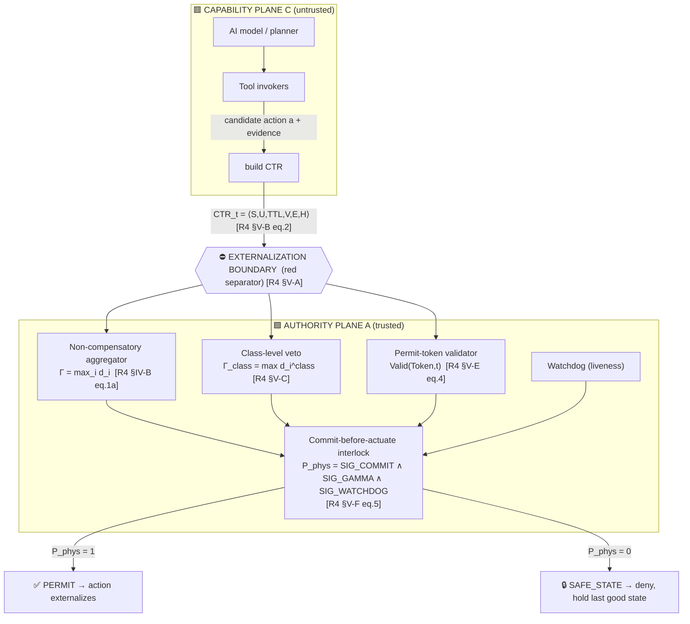
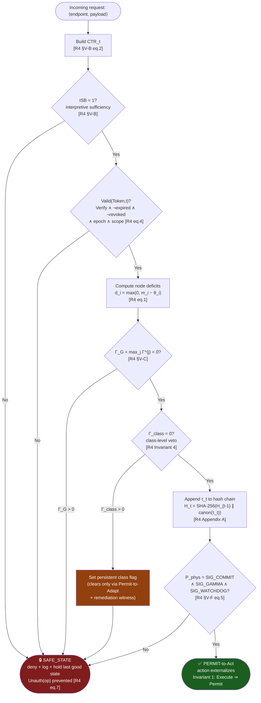

# 🛡️ LAB v1.0 — Runtime AI Safety Verification Framework

> A runtime reference monitor that evaluates every AI-proposed action **before** it is allowed to externalize. If every governance dimension concurs, the action is **PERMITTED**; if any single dimension fails, the system denies and drops into **SAFE_STATE**.

This repository is a **reference implementation** of the *externalization monitor* specified in two companion papers by A. Gill-Lakhowal. The papers are the specification; this code is one instantiation of it (the "Tier-S / Tier-T software-realizable" profile in the papers' terms).

**Source specifications**

| Tag | Title | Manuscript | Used for |
|-----|-------|-----------|----------|
| **[R4]** | *Deterministic Runtime Enforcement: The Execution Authority for Autonomous AI Agents* (L-DREA) | IEEE Access submission, May 2026 | Threat model, 5 structural properties, 6 invariants, LAB v1.0 benchmark spec, TLA⁺ Invariant 1, ablation/latency numbers |
| **[A9]** | *Deterministic Runtime Enforcement for Autonomous AI Agents: A Substrate-Neutral Reference Monitor for the Execution Boundary* | IEEE Access Manuscript Access-2026-24317 (9-page) | Same architecture, condensed; patent disclosure appendix; OAP latency anchor; "four structural properties" framing |

Where the two papers differ, this README flags it. Where this **code claims something the papers do not substantiate**, this README flags that too (see [§9 Honesty / scope](#9-honesty-and-scope-what-this-repo-does-and-does-not-prove)).

---

## Table of contents

1. [What problem this solves](#1-what-problem-this-solves-and-why)
2. [Architecture (with diagram)](#2-architecture)
3. [The decision rule — where every formula comes from](#3-the-decision-rule--formula-provenance)
4. [Per-request verification flow (flowchart)](#4-per-request-verification-flow)
5. [File → paper-section provenance map](#5-file--paper-section-provenance-map)
6. [Attack scenarios → threat-model provenance](#6-attack-scenarios--threat-model-provenance)
7. [Dashboard sections → paper provenance](#7-dashboard-sections--paper-provenance)
8. [How to run](#8-how-to-run)
9. [Honesty and scope](#9-honesty-and-scope-what-this-repo-does-and-does-not-prove)
10. [Citation](#10-citation)

---

## 1. What problem this solves, and why

**The gap [R4 §I-A, A9 §I-A].** Modern AI systems are not passive text oracles — they move funds, dispatch messages, actuate devices, and mutate their own parameters. Training-time alignment, output classifiers, and policy overlays constrain *which actions are proposed*; they are **not a reference monitor over what is executed**. This code sits at that *action boundary*.

**Why fail-closed and non-compensatory [R4 §I-A].** Operational risk is asymmetric. Let `L_unauth` be the expected loss from one unauthorized externalization and `L_deny` the loss from one benign denial. In high-consequence settings `L_unauth / L_deny > 10⁴` — a single catastrophic execution dwarfs the aggregate cost of many false denials. That asymmetry is the entire justification for: conservative fail-closed semantics, non-compensatory aggregation, and explicit runtime authorization boundaries even at the cost of elevated false-denial rate.

**The lineage [R4 §IV-A, A9 §IV-A].** Anderson's 1972 reference monitor specified three irreducible properties for any mediation component: *complete mediation*, *tamper-resistance*, *verifiability*. This framework **generalizes Anderson's primitive from data access to externally effective action** and adds structural properties Anderson did not have. (Note: **R4 adds two** — non-compensatory aggregation *and* epistemic bounding, for five total; **A9 adds one** — non-compensatory aggregation, for four total. This repo implements the decision-relevant four; epistemic bounding is documentary, see §9.)

---

## 2. Architecture

The system is a **two-plane runtime** [R4 §V-A, A9 §V-A]. The capability plane (untrusted) proposes actions; the authority plane (trusted) decides whether they may cross the externalization boundary. Nothing externalizes without a valid Permit-to-Act.



**Substrate tiers [R4 §V-G].** The paper defines three: **Tier-H** (FPGA/ASIC hardware-rooted, canonical), **Tier-T** (TEE/SGX), **Tier-S** (software-only, degraded). **This repo is a Tier-S / Tier-T-style software realization** — it preserves complete mediation, tamper-resistance to capability-plane code, verifiability, and non-compensatory aggregation, but it does **not** provide the physical-isolation clause of Assumption A3. That is the honest classification (see §9).

---

## 3. The decision rule — formula provenance

Every formula the code evaluates, mapped to the exact equation in the paper, with *what* it does and *why*.

### 3.1 Per-metric deficit `[R4 §IV-B eq.1]`

```
d_i = max(0, m_i − θ_i)
```

- **What:** for each governance metric `m_i` with admissibility threshold `θ_i`, compute how far it is over the line. `d_i = 0` iff the metric is within threshold.
- **Why:** turns heterogeneous checks (sanctions freshness, allergy contraindication, telemetry age…) into a uniform non-negative "deficit" so they can be aggregated without unit mismatch.

### 3.2 The Law of Concurrence — the aggregate `[R4 §IV-B eq.1a, A9 §IV-B]`

```
Γ = max_i d_i           (aggregate deficit)
Π = 1[Γ = 0]            (permit indicator)  [R4 eq.1b]
```

- **What:** the permit is granted **only if every deficit is zero**. The max-aggregator means no surplus on one dimension can offset a deficit on another.
- **Why this aggregator and not others `[R4 §IV-B, Corollary 2]`:** a disjunctive aggregate `Γ_∨ = min_i d_i` permits whenever *any* dimension is clean; a weighted aggregate `Γ_w = Σ w_i d_i` permits when a weighted sum is below threshold. **Both admit compensation and therefore cannot certify fail-closed semantics** for asymmetric-loss deployments. The repo's negative-control baseline (`Γ` replaced by weighted sum) exists precisely to demonstrate this — it leaks (FPR 6.4%) where the max-aggregator does not.
- **Equivalence the code relies on `[R4 Proposition 1, A9 "Law of Concurrence"]`:** `Γ = 0 ⇔ ∀i, d_i = 0`. This is what lets `SIG_GAMMA` be a single boolean.

### 3.3 Class-level veto `[R4 §V-C, Invariant 4]`

```
Γ_G     = max_j Γ^(j)              (global, over node-level predicate classes)
Γ_class = max_{i∈I_class} d_i^class (drift / reward-hacking / autonomy-band)
authority granted iff  max(Γ_G, Γ_class) = 0
```

- **What:** a *separate* veto over class-level metrics (behavioral drift, Goodhart proxies). Once a class-level deficit is recorded, that behavior class is denied **until explicit remediation** — it does not clear on its own.
- **Why:** prevents Goodhart-style optimization toward node-level cleanness at class-level expense. Persistence is the point: no run of node-level-clean actions can silently lift the flag; only a `Permit-to-Adapt` carrying a remediation witness clears it `[R4 Invariant 4 persistence clause]`.

### 3.4 Permit-token validity `[R4 §V-E eq.4, A9 §V-E]`

```
Valid(Token, t) = Verify(σ) ∧ (t ≤ expires_at) ∧ ¬Revoked(Token)
                  ∧ (K_t = K_current) ∧ ScopeOK(op, scope)
```
Token lifecycle: `ISSUED → ACTIVE → {CONSUMED, EXPIRED, REVOKED}`; consumption is **atomic and single-use** `[R4 §V-E]`.

- **What / why:** binds each action to an epoch-keyed, scope-checked, single-use token so a permit cannot be forged, replayed, scope-escalated, or used past expiry/revocation.
- ⚠️ **Provenance caveat:** the papers specify `σ` as a **signature under the issuer's epoch key** (existential unforgeability under EUF-CMA, Assumption A1). Your repo's README says "**HMAC** token validation." HMAC is a *symmetric MAC*, not the asymmetric signature the papers model. This is a legitimate Tier-S simplification, but it is **not** what `[R4 §V-E / Assumption A1]` specifies — call it out as such rather than implying parity. See §9.

### 3.5 Commit-before-actuate interlock `[R4 §V-F eq.5, A9 §V-F]`

```
P_phys = SIG_COMMIT ∧ SIG_GAMMA ∧ SIG_WATCHDOG
```
- `SIG_GAMMA` asserts iff `max(Γ_G, Γ_class) = 0`
- `SIG_COMMIT` asserts iff `τ_t` is appended to the hash chain **and** `Valid(Token, t)`
- `SIG_WATCHDOG` asserts iff no liveness fault
- The protocol **writes the trace record and advances the hash chain *before* asserting `P_phys`** — hence "commit-before-actuate."

- **Why conjunctive `[R4 condition C8]`:** no single subsystem may authorize unilaterally; arbitration is `∧`, never `∨`.
- ⚠️ **Provenance caveat:** in the papers, `P_phys` is a **hardware combinational signal** at a Tier-H FPGA gate that capability-plane software *cannot assert* (Assumption A3). In this software repo it is a boolean in a process — the conjunction logic is faithful, the *isolation guarantee is not*. See §9.

### 3.6 Hash-chained trace `[R4 Appendix A, A9 Appendix A]`

```
H_t = SHA-256(H_{t−1} ∥ canon(τ_t))
```
Canonical encoding: UTF-8 / NFC, lexicographic field order, fixed-point (12 fractional digits) for policy scalars, IEEE-754 round-to-nearest-even for residual floats.

- **What / why:** makes every prior cycle deterministically replayable and tamper-evident (`Replay Determinism Rate` metric). Canonicalization is what makes the Mealy machine `[R4 §IV-E]` bitwise re-executable by any verifier.

### 3.7 Interpretive-sufficiency bit `[R4 §V-B, A9 §V-B]`

```
ISB_t = ⋀_i π_i^sig(S_t) ∧ π^ttl(TTL_t) ∧ π^unc(U_t)
```
- **What / why:** a precondition gate — refuses to even score an action whose context translation is structurally insufficient (missing signals, stale TTL, excess uncertainty). It is one of the four ways `Unauth(op)` can be true `[R4 §VIII-C eq.7]`.

### 3.8 The global safety invariant (what all of the above is for) `[R4 §VI eq.6, A9 §VI]`

```
G [ Execute ⇒ (Γ_G = 0 ∧ Γ_class = 0 ∧ Commit) ]
```
- Read: *globally (always), if something executes, then both deficits were zero and the trace was committed.* This is the property the TLA⁺ model in `[R4 Appendix D]` mechanically checks for Invariant 1.

### 3.9 Operational definition of a failure (the thing the benchmark counts) `[R4 §VIII-C eq.7, A9 §VIII-C]`

```
Unauth(op) = Execute(op)=1 ∧ [ ¬Valid(Token,t_use)
                              ∨ max(Γ_G,Γ_class) > 0
                              ∨ ISB = 0
                              ∨ evidence pointer invalid ]
```
- **What / why:** the precise, deterministic ground-truth definition of "unauthorized execution." The headline `FPR = 0/360,000` is the count of `Unauth = 1` events. This is why the benchmark needs **no human judge** — the label is a state-diff, not an opinion.

---

## 4. Per-request verification flow

The exact order `maincode.py` evaluates a request. Each gate maps to a formula in §3 and an invariant in `[R4 §VI]`.



**Key property the order encodes `[R4 Invariant 3 / Corollary 1]`:** the moment *any* `d_i > 0`, `Γ > 0`, so `Π = 0` and the request short-circuits to `SAFE_STATE` — regardless of how clean every other dimension is. There is no path where a "good enough" weighted average rescues a failing safety predicate.

---

## 5. File → paper-section provenance map

| Repo file | Implements | Paper source | Why it exists |
|-----------|-----------|--------------|---------------|
| `maincode.py` | The full per-request monitor: CTR build, ISB gate, token validation, `Γ`/`Γ_class` aggregation, commit-before-actuate, SAFE_STATE | [R4 §IV–VI], [A9 §IV–VI] | The reference externalization monitor — the thing the whole paper specifies |
| `lab_benchmark.py` | The LAB v1.0 evaluation protocol: 5 adversarial scenario classes, 7-family mutation library, 6 primary metrics, negative control | [R4 §VIII], [A9 §VIII] | Reproducible, judge-free benchmark of *governance correctness, not task accuracy* [R4 §VIII-A] |
| `testdata.csv` | Test items `T_i = ⟨CTR_i, Token_i, PolicyID_i, ExpectedPermit_i, Class_i⟩` | [R4 §VIII-E], [A9 §VIII-E] | Deterministic ground truth so labels are state-diffs, not opinions |
| `test_baseline_metrics.py` | Negative-control: `Γ` → weighted sum, no substrate, no class veto → expect measurable leakage | [R4 §IX-C], [A9 §IX-C] | Proves the mutation library produces real attack signal (paper: FPR 6.4%) |
| `test_corpus_enforcement.py` | Invariant battery — checks that no `Unauth(op)=1` event slips through | [R4 §VI Invariants 1–6, §VIII-C eq.7] | The pass/fail conscience of the repo |
| `ertuple_audit_manifest.json` | Per-item ERTuple records + ledger snapshot | [R4 §IX-I "raw per-item ERTuple records and aggregate Hydra Ledger snapshots"] | Tamper-evident audit trail; replay-determinism evidence |
| `maincodedashboard.html` | Visual report of the run | [R4 §IX results tables] | Human-readable view of the four metric families |

---

## 6. Attack scenarios → threat-model provenance

The repo's attack simulations map directly onto the LAB scenario taxonomy and the threat model. Each is a thing the **adversary may attempt** `[R4 §III]`, organized into LAB classes `[R4 §VIII-D, A9 §VIII-D]`.

| Repo attack sim | LAB class | Threat-model capability | Mutation family `[R4 §VIII-F]` | Defended by |
|-----------------|-----------|------------------------|-------------------------------|-------------|
| Prompt injection / fake authorization | **LAB-A1 Direct Bypass** | (i) Execution without a permit | signature detachment/substitution | Complete mediation + `P_phys` interlock; Invariant 1 |
| Forged / replayed / scope-escalated token | **LAB-A2 Token Manipulation** | (ii) Forgery, replay, scope escalation, expiration masking | token-field fuzzing; scope/expiration perturbation | `Valid(Token,t)` [eq.4]; single-use consumption; Invariant 2 |
| Context manipulation | **LAB-A3 Context Corruption** | (iii) CTR tampering / adversarial context injection | CTR byte/field tampering; structured-field smuggling | CTR content hash + ISB gate |
| Replay / TOCTOU race | **LAB-A4 Timing Exploitation** | (iv) TOCTOU races on permit validity | clock-skew & revocation-race simulation | Invariant 5; `ε + Δ_rev ≤ Δ_TOCTOU` (Assumption A4) |
| Privilege escalation / sanctions-drift / multi-agent liquidity / compound failure | **LAB-A5 Goodhart Optimization** | (v) Node-level-clean while degrading class metrics | long-horizon drift synthesis | Class-level veto + persistence; Invariant 4 |

**Adaptive attacker.** The repo's "stress" scenarios correspond to the paper's **adaptive adversary with full source, policy, and key-schedule knowledge** `[R4 §IX-H, A9 §IX-F]`, which violates Assumption A1 *in simulation* to stress-test the non-cryptographic machinery. Paper result: 0 false permits across 120,000 attempts; FDR up to 4.8% under worst-case crafted CTRs (proving the attack *reached* the monitor and was denied, not missed).

---

## 7. Dashboard sections → paper provenance

| Dashboard section | Shows | Paper source |
|-------------------|-------|--------------|
| **§1 Runtime Enforcement Overview** | total evaluated, adversarial subset, unauthorized permits, replay determinism, baseline comparison | [R4 §IX-A/B], Table 3 |
| **§2 Stress Test Scenarios** | per-scenario PERMIT / SAFE_STATE / documented scope limitation | [R4 §X domain instantiations]; scope-limitation framing from [R4 §XII-A residual audit] |
| **§3 Performance & Security Metrics** | latency, throughput, replay determinism, ablation | [R4 §IX-D ablation, §IX-G latency] |
| **§4 Benchmark Reproduction** | implementation vs LAB v1.0 reference claims; invariants; adaptive resistance | [R4 §VIII metrics, §IX-E pre-registration] |
| **Final Runtime Report** | combined logs + audit verdict | [R4 §IX-I artifact manifest] |

**Reference numbers from the papers** (targets your dashboard compares against), all stated *within the documented threat surface and mutation library* `[R4 Table 3/4, §IX-G]`:

| Metric | Paper value | Source |
|--------|-------------|--------|
| FPR (naïve, adversarial) | `0 / 360,000`, Wilson UB `< 8.3 × 10⁻⁶` | [R4 Table 3] |
| FPR (cluster-corrected, DE≈1.7) | Wilson UB `< 1.4 × 10⁻⁵` | [R4 Table 3] |
| Replay Determinism | `99.9994% ± 0.0002%` | [R4 Table 3] |
| Remove non-compensatory Γ | FPR `1.72%` | [R4 Table 4] |
| Remove class-level veto | FPR `3.11%` (largest single contributor) | [R4 Table 4] |
| Tier-S (software only) | FPR `0.63%` | [R4 Table 4] |
| Mean authorization latency | `54.3 ms` (p99 = 62 ms) | [R4 §IX-G] |
| Throughput | `15,000 TPS` (32 threads) | [R4 §IX-G] |
| TLA⁺ Invariant 1 model check | `2,489,446` states gen, `40,192` distinct, depth 7, **0 violations** | [R4 Appendix D] |

⚠️ See §9 before treating any of these as "results this repo reproduces."

---

## 8. How to run

**Requirements:** Python 3.9+ (standard library only).

```bash
git clone <repository-url>
cd LAB-v1

# Run the monitor + benchmark (Windows)
python maincode.py
# macOS / Linux
python3 maincode.py
```

Then open `maincodedashboard.html` in any browser.

`maincode.py` will: load `testdata.csv`, run the per-request monitor (§4), execute the attack simulations (§6), compute the six LAB metrics (§3.9), write the ERTuple audit manifest, and generate the dashboard (§7).

---

## 9. Honesty and scope — what this repo does and does **not** prove

This section exists because the papers themselves are scrupulous about scope `[R4 §XII-A, "Scope of evaluation" box p.11]`, and the README should match that discipline.

**What the papers' headline actually is.** The `0/360,000` zero-event result is stated **relative to a fixed mutation library and documented threat surface**, with a cluster-corrected Wilson **upper bound** of `1.4 × 10⁻⁵` — *not* a universal absence-of-failure claim `[R4 Abstract, §IX, Table 3]`. The paper's own expectation-setting says it does **not** expect the zero-event headline to transfer to public benchmarks like AgentDojo `[R4 §IX-E.4]`.

**What is measured vs. designed.** In the papers, the empirical numbers come from a **hardware-in-the-loop benchmark instrument (Tier-H: Kintex-7 FPGA + SGX enclave)**, explicitly **not a fielded production system** `[R4 "Scope of evaluation" box; A9 §IX-A "we do not claim it is from a fielded production system"]`. The independent-benchmark evaluation against AgentDojo/AgentHarm is **pre-registered, not yet completed** (target Q3 2026) `[R4 §IX-E, Appendix C]`. Mechanization beyond Invariant 1 is **roadmap, not done** `[R4 §VI-C, A9 §VI-B]`.

**Where this code diverges from the spec — state it plainly:**

| Repo claims | Paper specifies | Honest status |
|-------------|-----------------|---------------|
| "HMAC token validation" | Epoch-keyed **signature** `σ`, EUF-CMA unforgeable (Assumption A1) [R4 §V-E] | Symmetric-MAC simplification; weaker trust model than specified |
| `P_phys` as a software boolean | **Hardware** combinational gate, capability-plane cannot assert (Assumption A3) [R4 §V-F/§V-G] | This is **Tier-S** (software-only, degraded) — the paper rates Tier-S at FPR 0.63%, *not* 0 [R4 Table 4] |
| Dashboard "Benchmark Reproduction" with the paper's numbers | Numbers are from the authors' Tier-H instrument | A software run **cannot** reproduce Tier-H FPR; if the dashboard prints `0/360,000`, that is the *target*, not a measurement from this code, unless your run genuinely produced it on its own corpus |
| "Epistemic bounding" not represented | 5th structural property in R4 (documentary: what the monitor *refuses to claim*) [R4 §IV-C] | Out of code scope — it's a conformance-doc property, fine to omit but worth naming |

**Bottom line.** This repo is a faithful, runnable **Tier-S reference implementation of the L-DREA decision logic and LAB v1.0 protocol**. It demonstrates the *architecture and the non-compensatory rule* correctly. It does **not** — and the papers do not claim it could — deliver the hardware-rooted guarantee or the independent-benchmark validation. Treat the paper's numbers as **specification targets**, and report whatever *your* run measures on *your* corpus, separately and honestly.

---

## 10. Citation

If you use this framework, cite both specifications:

```bibtex
@article{gill2026ldrea,
  title   = {Deterministic Runtime Enforcement: The Execution Authority for Autonomous AI Agents},
  author  = {Gill-Lakhowal, Abhinandan},
  journal = {IEEE Access (submitted)},
  year    = {2026},
  note    = {L-DREA; Manuscript Access-2026-24317}
}
```

Related patent disclosure (prior-art transparency only; technical/empirical claims do not depend on grant) `[A9 Appendix D]`: U.S. Application 19/383,841 (pub. US 2026/0127298 A1), and pending applications 19/369,251, 19/386,298, 19/388,667, 19/420,911, 19/439,912, 19/442,529, 19/457,709.

---

*This README maps implementation to specification. Where they disagree, the specification's stated scope governs and the divergence is flagged above.*
