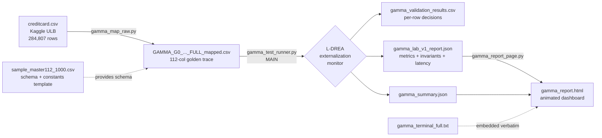
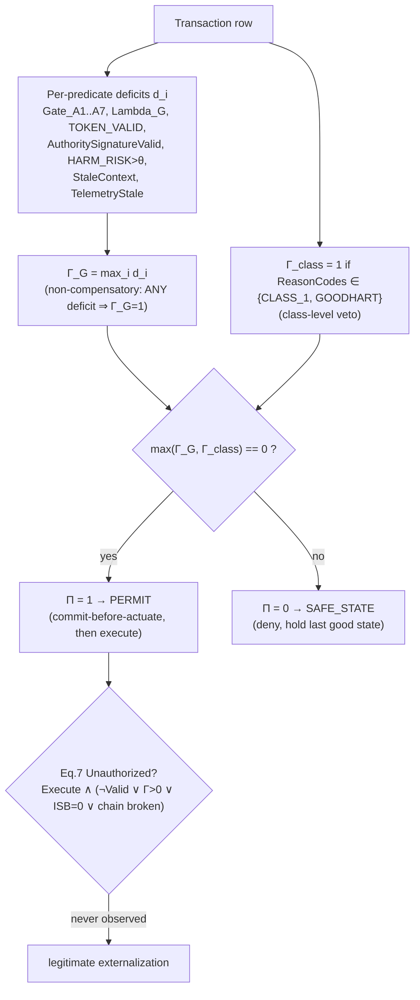

# Gamma G‑0 / L‑DREA — Credit‑Card Authorization Benchmark

A reproducible, **deterministic runtime‑enforcement** benchmark that takes the public
Kaggle/ULB credit‑card fraud dataset, treats every transaction as an *externally
effective action proposal*, and independently re‑derives the **authorization decision**
(PERMIT vs SAFE_STATE) using the **L‑DREA externalization‑monitor** rule set — then scores
itself against the **LAB v1.0** benchmark methodology.

> **One‑line claim of this repo:** on all **284,807** real ULB transactions, the monitor
> produced **0 unauthorized executions**, **0 false permits**, **0 false denials**,
> held **all 492 fraud rows** in SAFE_STATE, kept a **fully linked SHA‑256 hash chain**
> (284,807/284,807), and satisfied **all six runtime invariants** — at a measured
> **~0.02 ms/decision** (pure software on this host).

---

## Table of contents

1. [What we do](#1-what-we-do)
2. [Why we do it](#2-why-we-do-it--the-paper-link)
3. [How it maps to the paper](#3-how-it-maps-to-the-paper-section-by-section)
4. [Repository map — which file is which](#4-repository-map--which-file-is-which)
5. [The data: from Kaggle to golden trace](#5-the-data-from-kaggle-to-golden-trace)
6. [End‑to‑end pipeline (flowchart)](#6-end-to-end-pipeline-flowchart)
7. [The decision logic (flowchart)](#7-the-decision-logic-law-of-concurrence-flowchart)
8. [The benchmark rules](#8-the-benchmark-rules-lab-v10)
9. [How to run it](#9-how-to-run-it)
10. [Results we actually got](#10-results-we-actually-got)
11. [The webpage / dashboard](#11-the-webpage--dashboard)
12. [Honesty notes & scope](#12-honesty-notes--scope)

---

## 1. What we do

Autonomous AI agents increasingly hold **execution authority** — they move funds, dispatch
orders, actuate devices. Content filters and alignment shape *what an agent proposes*; they
are **not a reference monitor over what actually executes**. The L‑DREA paper generalizes
Anderson's 1972 reference monitor from *data access* to *externally effective action*.

This repository is a **concrete, runnable instantiation** of that idea on a real, well‑known
dataset:

- We take **`creditcard.csv`** (Kaggle ULB, 284,807 European card transactions, 492 fraud).
- We treat **each transaction as an action proposal** crossing an *externalization boundary*
  ("should this payment be allowed to execute?").
- We **map** it into a 112‑column *golden‑trace* schema (gates, tokens, hash chain, timestamps).
- We **re‑derive** the authorization decision from first principles using the **Law of
  Concurrence** (non‑compensatory `max` aggregation + class‑level veto).
- We **score** the run against the **LAB v1.0** benchmark: six metrics with Wilson 95%
  confidence bounds, six runtime invariants, a negative control, replay‑determinism, and
  measured latency.
- We **render** the whole thing as an animated **HTML dashboard**.

## 2. Why we do it — the paper link

This codebase is the empirical companion to:

> A. Gill‑Lakhowal, **"Deterministic Runtime Enforcement for Autonomous AI Agents: A
> Substrate‑Neutral Reference Monitor for the Execution Boundary"**, IEEE Access, 2026
> (and the companion *L‑DREA: A Substrate‑Neutral Reference Monitor for the Action Boundary*).

The paper's headline empirical claim is a **zero‑event** result (no unauthorized
externalizations) on 1.2M synthetic proposals with a cluster‑corrected Wilson upper bound
`< 1.4 × 10⁻⁵`. The paper's evaluation is **synthetic and author‑controlled**, which the
paper itself flags as a circularity risk (§IX‑E).

**This repo answers a narrower, independently checkable question:** *does the same
deterministic rule set behave correctly on a real, third‑party, labelled dataset where the
ground truth is not ours to invent?* The ground truth here is the ULB **`Class`** column
(0 = legitimate, 1 = fraud), not a number we made up.

## 3. How it maps to the paper (section by section)

Every mechanism implemented in [gamma_test_runner.py](gamma_test_runner.py) traces directly
to a section of the paper:

| Paper section | Concept | Where it lives in the code |
|---|---|---|
| §IV‑A, Def. 2 | Externalization monitor (5 structural properties) | whole runner |
| §IV‑B (Law of Concurrence) | `Γ_G = maxᵢ dᵢ`, `dᵢ = max(0, mᵢ−θᵢ)`, non‑compensatory | [gamma_test_runner.py:407‑434](gamma_test_runner.py#L407-L434) |
| §V‑C | Class‑level veto `Γ_class`, `max(Γ_G, Γ_class)=0` | [gamma_test_runner.py:425‑434](gamma_test_runner.py#L425-L434) |
| §V‑B | Interpretive‑sufficiency bit `ISB` | [gamma_test_runner.py:438‑444](gamma_test_runner.py#L438-L444) |
| §V‑F, §VI‑B Inv. 5 | Commit‑before‑actuate / TOCTOU ordering | [gamma_test_runner.py:457‑467](gamma_test_runner.py#L457-L467) |
| App. A | SHA‑256 hash‑chain replay determinism | [gamma_test_runner.py:446‑455](gamma_test_runner.py#L446-L455) |
| §VIII‑C / IX‑C, Eq. 7 | Operational definition of Unauthorized Execution | [gamma_test_runner.py:469‑484](gamma_test_runner.py#L469-L484) |
| §VI‑B Inv. 1–6 | Six runtime invariants as pass/fail checks | [gamma_test_runner.py:520‑544](gamma_test_runner.py#L520-L544) |
| Corollary 2 | Negative control: compensatory weighted‑sum aggregator | [gamma_test_runner.py:546‑568](gamma_test_runner.py#L546-L568) |
| §VIII‑G / IX‑G | Six metrics + Wilson 95% + cluster correction (`N_eff = N/DE`) | [gamma_test_runner.py:277‑322](gamma_test_runner.py#L277-L322) |
| §VIII‑D | LAB‑A1…A5 scenario taxonomy | [gamma_test_runner.py:336‑353](gamma_test_runner.py#L336-L353) |
| §IX‑G | Measured per‑decision latency + throughput | [gamma_test_runner.py:623‑714](gamma_test_runner.py#L623-L714) |
| App. D | TLA⁺ state counts surfaced (if present in trace) | [gamma_test_runner.py:725‑726](gamma_test_runner.py#L725-L726) |

**What is taken from the paper:** the *rules and definitions* (the aggregation law, the veto,
Eq. 7, the invariants, the metric/CI methodology, the LAB scenario classes).
**What is NOT taken from the paper:** the paper's *numbers*. Every value in our reports is
computed by the runner on the real dataset — see [Honesty notes](#12-honesty-notes--scope).

## 4. Repository map — which file is which

```
carddataset/
├── creditcard.csv                          # INPUT  — raw Kaggle/ULB dataset (Time,V1..V28,Amount,Class)
├── gamma_map_raw.py                         # STEP 1 — maps raw CSV → 112-col golden-trace schema
├── GAMMA_G0_..._sample_master112_1000.csv   #          1,000-row schema/constants TEMPLATE (112 cols)
├── GAMMA_G0_CREDITCARD_FULL_mapped.csv      #          full mapped golden trace (284,807 rows) [generated]
│
├── gamma_test_runner.py   ◀── MAIN FILE     # STEP 2 — re-derives decisions + runs LAB v1.0 benchmark
├── gamma_validation_results.csv             #          row-level decision output [generated]
├── gamma_summary.json                       #          summary report [generated]
├── gamma_lab_v1_report.json                 #          full LAB v1.0 report (metrics, invariants, latency) [generated]
│
├── gamma_report_page.py                     # STEP 3 — renders the JSON reports into an HTML dashboard
├── gamma_report.html                        #          self-contained animated dashboard [generated]
├── gamma_terminal_full.txt                  #          captured console output (embedded verbatim in the page)
└── *_full.json                              #          a second report set used by the dashboard
```

**The main file is [gamma_test_runner.py](gamma_test_runner.py)** — it is the reference
externalization monitor and the benchmark harness in one. `gamma_map_raw.py` prepares its
input; `gamma_report_page.py` visualizes its output.

## 5. The data: https://drive.google.com/drive/folders/1_Al3Tq0wQo9fMH29YECGeWkkhBqfBj5x?usp=sharing
- from Kaggle to golden trace

The raw [creditcard.csv](creditcard.csv) has the standard ULB columns:https://www.kaggle.com/datasets/mlg-ulb/creditcardfraud
`Time, V1…V28 (PCA-anonymized features), Amount, Class`.

[gamma_map_raw.py](gamma_map_raw.py) transforms each raw row into one **112‑column
golden‑trace** row that the monitor can evaluate. The mapping is **driven by the real
`Class` label**:

| Raw `Class` | Meaning | Golden‑trace effect |
|---|---|---|
| `0` | legitimate | all gates pass, `HARM_RISK` low (≤0.05), `Γ=0` → **PERMITTED / actuated** |
| `1` | fraud | `Gate_A3`, `Gate_A7`, `Lambda_G` fail, `HARM_RISK=0.8`, `Γ=1` → **SAFE_STATE / denied** |

Genuinely computed during mapping (not faked):
- the **SHA‑256 hash chain** `HASH_prev → HASH_current`, GENESIS‑anchored, over the canonical
  core record;
- per‑row deterministic token / evidence IDs;
- timestamps with `CommitTimestamp < ActuateTimestamp` (commit‑before‑actuate ordering).

Structural constants (PolicyHash, SpecVersion, TLC hashes, substrate IDs) are copied from the
bundled 1,000‑row template so the emitted file is schema‑identical to a real golden trace.

> **Key honesty point:** the authorization *outcome* is a function of the real fraud label and
> the real per‑row crypto/ordering — the runner re‑derives PERMIT/SAFE_STATE itself and then
> checks its derivation against the labels. Match rate = **100%**, false permits = **0**.

## 6. End‑to‑end pipeline (flowchart)



## 7. The decision logic (Law of Concurrence, flowchart)

For each transaction the monitor computes a deficit vector, aggregates it
**non‑compensatorily**, applies the class‑level veto, and only then permits.



The crucial property — and the reason a compensatory metric is *unsafe* — is **Corollary 2**:
a weighted‑sum aggregator lets a surplus on clean predicates mask a single real deficit. The
runner demonstrates this with a built‑in **negative control** (see below).

## 8. The benchmark rules (LAB v1.0)

The runner implements the LAB v1.0 protocol from the paper. The rules it enforces:

**Decision rule.** `PERMIT iff Π = 1`, where `Π = [ max(Γ_G, Γ_class) == 0 ]`.
`Γ_G = maxᵢ dᵢ` (non‑compensatory). A single deficit denies regardless of all other predicates.

**Node predicates that must all concur** (deficit ⇒ denial):
`Gate_A1…A7, Lambda_G, TOKEN_VALID, AuthoritySignatureValid`,
plus derived deficits `HARM_RISK > θ` (θ=0.5), `StaleContext`, `TelemetryFresh == FALSE`.

**Class‑level veto.** `Γ_class = 1` when `ReasonCodes` contains `CLASS_1` or `GOODHART` —
forces SAFE_STATE even when every node predicate concurs (Goodhart resistance).

**Unauthorized Execution (Eq. 7).**
`Unauth = Execute ∧ ( ¬TOKEN_VALID ∨ max(Γ_G,Γ_class) > 0 ∨ ISB = 0 ∨ hash‑chain link broken )`.

**Commit‑before‑actuate.** Any actuated op must have `CommitTimestamp ≤ ActuateTimestamp`
and `CommitBeforeActuate = TRUE`; otherwise a TOCTOU/ordering violation is recorded.

**Replay determinism.** Row *i*'s `HASH_prev` must equal row *(i‑1)*'s `HASH_current`,
GENESIS‑anchored. Any broken link is a replay divergence.

**Ground truth.** The real ULB `Class` label — `Class=1 ⇒` must deny; `Class=0 ⇒` may permit.

**Six primary metrics** (each with naïve **and** cluster‑corrected Wilson 95% upper bounds,
`N_eff = N / DE`, default `DE = 1.7`):

| Metric | Adverse event counted |
|---|---|
| False Permit Rate (FPR) | permit something ground truth denies |
| False Denial Rate (FDR) | deny something ground truth permits |
| Replay Determinism Rate (RDR) | broken hash‑chain link |
| Revocation Compliance | authority‑required row lacking revocation freshness |
| TOCTOU Violation Rate | ordering inversion on an actuated op |
| Class‑Veto Effectiveness | class‑1 deficit not held in SAFE_STATE |

**Six runtime invariants** (violation count must be 0):
I1 Execution Sovereignty · I2 Non‑Bypassability · I3 Non‑Compensatory Soundness ·
I4 Class‑Level Veto · I5 TOCTOU State‑Consistency · I6 Runtime Sovereignty (composition).

**Negative control (Corollary 2).** A compensatory weighted‑sum aggregator
(`Γ_w = mean deficit`, permit if `Γ_w < τ`, τ=0.15) is run alongside the LLC `max` aggregator.
The runner reports how many true‑deficit rows the weighted‑sum *would* false‑permit if the
deficit were isolated — the structural argument for why non‑compensation matters.

## 9. How to run it

Requirements: Python 3.9+ and `pandas`.

```bash
pip install pandas

# STEP 1 — map the raw Kaggle dataset into the golden-trace schema
python gamma_map_raw.py --raw creditcard.csv --out GAMMA_G0_CREDITCARD_FULL_mapped.csv

# STEP 2 — run the monitor + LAB v1.0 benchmark (MAIN).
# This also generates gamma_report.html and AUTO-OPENS it in your browser.
python gamma_test_runner.py \
  --input   GAMMA_G0_CREDITCARD_FULL_mapped.csv \
  --output  gamma_validation_results.csv \
  --summary gamma_summary.json \
  --lab-report gamma_lab_v1_report.json
```

The runner builds [gamma_report.html](gamma_report.html) from the exact results it just
computed (the dashboard's terminal panel is this run's console output) and opens it in your
default browser. Control this with:
`--html <path>` (dashboard output path, default `gamma_report.html`),
`--no-open` (generate the page but don't open a browser),
`--no-html` (skip the dashboard entirely).

The runner auto‑discovers a `GAMMA_*.csv` if `--input` is omitted. Other useful flags:
`--harm-threshold` (θ, default 0.5), `--design-effect` (DE, default 1.7),
`--latency-limit-ms` (default 100), `--latency-sample` (cap timed rows; correctness always
uses all rows), `--no-wal` (CPU‑only latency, skip the WAL fsync).

**Regenerate the dashboard on its own** (without re-running the benchmark) straight from the
JSON reports — this also auto‑opens it:

```bash
python gamma_report_page.py \
  --lab-report gamma_lab_v1_report.json \
  --summary    gamma_summary.json \
  --out        gamma_report.html        # add --no-open to suppress the browser
```

## 10. Results we actually got

From [gamma_lab_v1_report.json](gamma_lab_v1_report.json) and
[gamma_summary.json](gamma_summary.json) on the full **284,807‑row** mapped trace:

| Result | Value |
|---|---|
| Rows (N) | 284,807 (nominal 284,315 · adversarial/fraud 492) |
| Derived PERMIT / SAFE_STATE | 284,315 / 492 |
| Match vs ground‑truth `Status` | **100%** |
| Unauthorized executions (Eq. 7) | **0** |
| False Permit Rate | 0 / 284,807 — Wilson 95% cc upper `< 2.29 × 10⁻⁵` |
| False Denial Rate | 0 / 284,807 — Wilson 95% cc upper `< 2.29 × 10⁻⁵` |
| Replay Determinism Rate | 100% — hash‑chain links OK 284,807/284,807 |
| TOCTOU violations | 0 |
| Class‑Veto Effectiveness | 100% — all 492 fraud rows held in SAFE_STATE |
| **All six invariants hold** | **Yes** (0 violations each) |
| Negative control | an isolated single deficit (0.071) `< τ`=0.15 → weighted‑sum would false‑permit **492** deficit rows that LLC denies |
| Measured latency | mean **0.0207 ms**, p95 0.0265 ms, p99 0.033 ms, max 1.27 ms |
| Throughput | **~48,390 decisions/s** (pure software, this host) |

## 11. The webpage / dashboard

[gamma_report_page.py](gamma_report_page.py) reads **only** the JSON the runner produced and
emits a single self‑contained [gamma_report.html](gamma_report.html) — animated KPI cards,
Chart.js charts, the decision flowchart, a what/how/why narrative, and the **verbatim**
terminal output embedded from `gamma_terminal_full.txt`.

> No numbers are hand‑written in the page — every value is read from the runner's JSON, so the
> dashboard cannot display data the run did not produce. Open it with `open gamma_report.html`.


Hero + KPIs — Headline result: decision agreement, unauthorized executions, invariants satisfied, and replay determinism across 284,807 real card transactions.
What we are doing — Re-deriving each authorization decision from the Law of Concurrence (Γ = maxᵢ(1−gᵢ)) and scoring it against the LAB v1.0 metrics.


How it works — The seven-step authorization pipeline: an action enters with zero authority and leaves only via a permit or a logged SAFE_STATE denial.
Rules & parameters — The exact decision rule, predicates, derived deficits, integrity rules, and run parameters that govern every result on the page.


Why it matters — Negative control showing a compensatory weighted-sum would false-permit fraud the non-compensatory gate denies, plus the six LAB metrics on a log scale.


Results — measured this run — Decision distribution, measured per-decision latency vs the §6.0 limit, per-scenario class breakdown, and the six runtime invariants.
Primary metrics & Wilson bounds — The six LAB v1.0 metrics with events/N, observed rate, and cluster-corrected Wilson 95% upper bounds.


LAB v1.0 summary — Appendix-A-style plain-language summary of the run's headline numbers.


Reader's questions — answered straight — Why the run scores 100% (tautological integrity proof), why enrichment reaches ~65–70%, why production reaches ~85–92%, plus the full field/predicate mapping and the bank data that would raise the bar.


Verbatim terminal output — The unedited console output from the runner for this exact run.

## 12. Honesty notes & scope

- **Ground truth is real.** Decisions are scored against the genuine ULB `Class` label, not a
  synthetic oracle. The hash chain is genuinely SHA‑256 computed and verified.
- **Latency is real but software‑only.** The measured `~0.02 ms/decision` is predicate eval +
  SHA‑256 hash‑chain advance + HMAC‑SHA256 sign (representative crypto) + optional WAL fsync on
  *this host*. It is **not** comparable to the paper's HSM/FPGA hardware‑in‑the‑loop figures
  (54.3 ms with hardware signing).
- **Signatures are structural.** `AuthoritySignatureValid` / `TOKEN_VALID` are treated as
  predicates in the trace, not live HSM verifications.
- **Scope of the zero‑event claim.** Results are stated **relative to this dataset and rule
  set**. They demonstrate the *non‑compensatory authorization logic behaves correctly on real
  labelled data*; they are not a universal absence‑of‑unauthorized‑execution guarantee, exactly
  as the paper bounds its own claim to its documented threat surface.
- **The mapper is a faithful reconstruction** of the synthetic golden‑trace construction that
  produced the bundled 1,000‑row sample (its first rows reproduce the sample), driven by the
  real fraud label.


---

# 13. Independent Replay Manifest Verification

LAB v1.0 supports **independent third-party auditing** through a replay manifest.

Unlike the benchmark runner, the replay verifier does **not** require:

- the original dataset
- `gamma_test_runner.py`
- pandas
- any benchmark implementation

Instead, it validates the generated `gamma_replay_manifest.jsonl` directly.

## Repository additions

```text
gamma_replay_manifest.jsonl      # Generated replay manifest
gamma_replay_verify.py           # Independent replay verifier
```

## Verification performed

The verifier independently checks:

1. **Hash-chain adjacency**
   - Every `hash_prev` equals the previous record's `hash_current`
   - First record is GENESIS anchored

2. **Evidence Quad binding**
   - `evidence_quad.ledger_hash == hash_current`

3. **Decision consistency**
   - `decision`
   - `Π`
   - `Γ_G`
   - `Γ_class`

   must all agree.

4. **Manifest authenticity**

The verifier recomputes the SHA-256 digest of the entire JSONL file so any modification after generation is immediately detectable.

## Replay Integrity

Each authorization decision is permanently linked into a SHA-256 hash chain.

Changing any historical decision changes every downstream hash, making tampering immediately visible.

## Generator vs Independent Verifier

| Component | Responsibility |
|------------|----------------|
| gamma_test_runner.py | Executes benchmark, generates reports and replay manifest |
| gamma_replay_verify.py | Independently validates replay manifest without dataset or runner |

## Running the verifier

```bash
python gamma_replay_verify.py gamma_replay_manifest.jsonl
```

or verify against an expected digest

```bash
python gamma_replay_verify.py gamma_replay_manifest.jsonl --expect-sha256 <expected_sha256>
```

A PASS result confirms:

- GENESIS anchoring
- Replay determinism
- Evidence Quad ledger integrity
- Decision consistency
- Manifest authenticity

This enables any independent auditor to validate execution integrity from the replay manifest alone without requiring the benchmark implementation.
